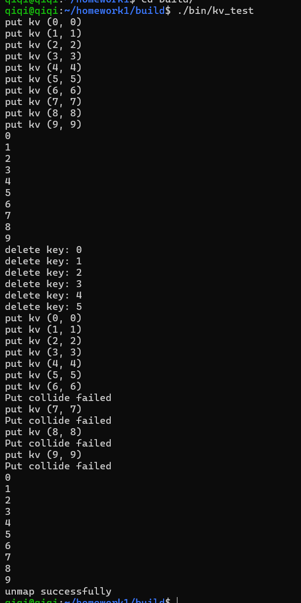

##### 单机、无并发的 KV store


##### 亮点

1. 模拟 Linux 的页表，将内存划分为多个块，每个块大小为 PAGE_SIZE(32B)；
2. 如果有一个数据大小不大于 PAGE_SIZE，则可能会产生“内碎片”；如果有大小大于 PAGE_SIZE，则使用多个 Page 去存储，也会产生“内碎片”；
3. Page 之间通过链表存储，链表本身不占 额外的内存；


##### 遇到的问题

1. 刚开始 memcpy 一直没复制成功，发现是 dst addr 超过了 mmap 分配的大小；
2. 后面发现数据总是改变，因为：先读取 disk 中数据，然后初始化 page，在初始化的过程，会破坏已经读取的数据；所以需要先初始化 page，然后读取 disk 中数据，并将其 put 进 page 中；


##### 用法

1. cmake -B build ./ && cd build
2. make
3. ./bin/kv_test


##### 测试

```cpp
auto kv = kv::KV<int, int>(file_path, sz, offset);

  {
    // 插入 (0, 0), (1, 1), ... , (9, 9)
    for (int i = 1; i < 10; i++) {
        printf("put kv (%d, %d)\n", i, i);
      kv.Put(i, i);
    }
  }

  {
    // 查询 key from 0 to 9
    for (int i = 1; i < 10; i++) {
      int value;
      if (kv.Get(i, value)) {
        std::cout << "Get: " << i << ", " << value << std::endl;
      }
    }
  }

  {
    // 删除 key from 0 to 5
    for (int i = 0; i < 6; i++) {
      if (kv.Delete(i)) {
        std::cout << "delete key: " << i << std::endl;
      }
    }
  }
  
  {
    // 插入 (0, 0), (1, 1), ... , (9, 9)
    for (int i = 0; i < 10; i++) {
        printf("put kv (%d, %d)\n", i, i);
      kv.Put(i, i);
    }
  }

  {
    // 查询 key from 0 to 9
    for (int i = 0; i < 10; i++) {
      int value;
      if (kv.Get(i, value)) {
        std::cout << value << std::endl;
      }
    }
  }
```


